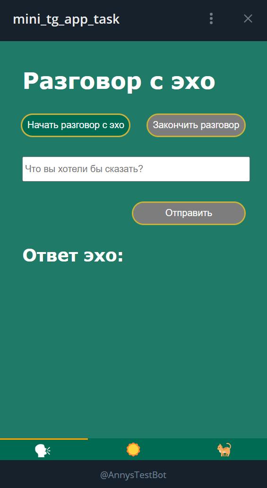

# Test Challenge - TG Mini Bot

[Запустить приложение](https://t.me/AnnysTestBot/MyMiniTgApp) ☝️

Контакт для связи: [t.me/talfril](https://t.me/talfril) или [talfril@gmail.com](mailto:talfril@gmail.com)

## Внешний вид приложения

## О приложении

Приложение написано на TypeScript и React, сборка осуществляется с помощью Vite. Реализован роутинг при помощи React Router с перенаправлением через кнопки внизу экрана. Актуальная страница в меню стилизуется в зависимости от того, где пользователь находится в конкретный момент.

### Страницы приложения

1. **Первая страница** - взаимодействие с [echo.websocket.org](https://echo.websocket.org).
2. **Вторая страница** - работа с API [Open Meteo](https://open-meteo.com/).
3. **Третья страница** - работа с пагинацией, изображения получены через API [Pexels](https://www.pexels.com/).
